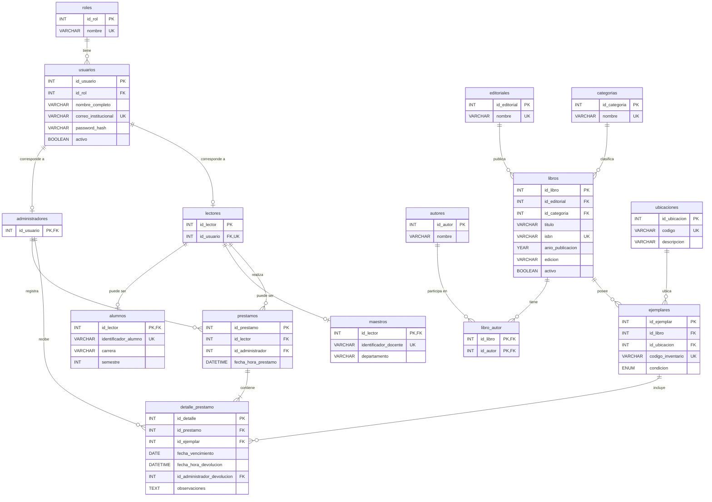

# BiblioApp

**Integrantes:**

- 24410172 - Miguel Angel Ramirez Francisco
- 24410479 - Rocío Jaqueline Bordier Flores
- 24410663 - Axel Rodrigo Cisneros Cano

---

## 1. Idea general

BiblioApp es una aplicación web para administrar el catálogo, libros y  préstamos de una biblioteca escolar. Está dirigida al personal de la biblioteca, alumnos y maestros.

Se ha detectado una dificultad para mantener un registro centralizado y actualizado. Algunos procesos aún se realizan mediante archivos separados, bases desactualizadas o fuera del acceso en línea útil hoy en día.

El objetivo del sistema es centralizar la información en una base de datos MySQL, facilitar el registro de préstamos y devoluciones y generar reportes que ayuden al personal a mantener un mejor control de la biblioteca.

Los alumnos y maestros registrarán su identificador institucional que permitirá distinguir su perfil dentro del sistema y podrán consultar sus préstamos e historial.

### 1.1 Alcance del sistema
- Registrar y autenticar cuentas:
    - Administradores (personal)
    - Lectores (alumnos y maestros)
- Administrar la información de los libros: autores, editoriales, categorías, ubicaciones y ejemplares físicos.
- Consultar el catálogo y disponibilidad de los ejemplares.
- Registrar préstamos y devoluciones.
- Consultar préstamos e historial personal.
- Generar reportes parametrizables.

### 1.2 Delimitaciones
El sistema no incluirá: 
- Reservas 
- Renovaciones
- Multas o cobros
- Compras a proveedores
- Préstamos interbibliotecarios
- Libros digitales
- Notificaciones automáticas
- Aplicación móvil nativa.

Los préstamos serán registrados por el administrador durante la entrega presencial. No habrá autorregistro de cuentas.

Las fechas de vencimiento se establecerán al registrar cada préstamo. No se implementarán políticas establecidas por la institución.

## 2. Descripción de tablas
Se integra la siguiente base de datos relacional compuesta por 14 tablas, normalizada hasta la Tercera Forma Normal (3FN):

| Tabla | Descripción y datos principales |
| --- | --- |
| `roles` | Define el tipo de cuenta y permisos: Administrador y Lector. Contiene identificador y nombre único del rol. |
| `usuarios` | Almacena nombre completo, correo institucional, hash de contraseña, estado activo/inactivo y referencia al rol. |
| `administradores` | Contiene la información específica del personal encargado de administrar la biblioteca. |
| `lectores` | Identifica a los usuarios que pueden recibir préstamos. Cada lector se asocia con una cuenta única mediante `id_usuario`. |
| `alumnos` | Extiende el perfil del lector con su identificador de alumno único. `id_lector` será clave primaria y foránea. |
| `maestros` | Extiende el perfil del lector con su identificador de docente único. `id_lector` será clave primaria y foránea. |
| `editoriales` | Registra las editoriales relacionadas con los libros del catálogo. |
| `categorias` | Registra la clasificación principal de los libros. |
| `autores` | Almacena los nombres de los autores que participan en las obras del catálogo. |
| `libros` | Registra título, ISBN, año de publicación, edición, editorial, categoría y estado activo/inactivo. Cada registro representa una edición bibliográfica. |
| `libro_autor` | Auxiliar en la relación de muchos a muchos entre libros y autores. Su clave primaria compuesta evita repetir la misma asociación. |
| `ubicaciones` | Registra los códigos y descripciones de estantes o secciones de la biblioteca. |
| `ejemplares` | Registra cada copia física con código de inventario único, libro, ubicación y condición operativa: habilitado, mantenimiento o baja. |
| `prestamos` | Almacena el lector, el administrador responsable del registro y la fecha y hora de la operación. |
| `detalle_prestamo` | Relaciona cada préstamo con sus ejemplares e incluye fecha de vencimiento, fecha y hora de devolución, administrador que recibe la devolución y observaciones. |

### 2.1 Diagrama de base de datos
El siguiente diagrama muestra las claves y relaciones principales. Las fechas de devolución y el administrador que recibe se mantendrán nulos mientras el ejemplar no haya sido devuelto.

## 3. Tipos de usuario (roles)

BiblioApp manejará dos roles de acceso: Administrador y Lector. El rol Lector se especializa en dos tipos de perfil: Alumno y Maestro.

| Rol               | Acciones principales                                                                                                                                                                                                                                                              |
| ----------------- | --------------------------------------------------------------------------------------------------------------------------------------------------------------------------------------------------------------------------------------------------------------------------------- |
| **Administrador** | Iniciar sesión; administrar usuarios, lectores y cuentas; gestionar libros, autores, editoriales, categorías, ubicaciones y ejemplares; registrar préstamos y devoluciones; consultar la disponibilidad de ejemplares; consultar historiales; y generar reportes parametrizables. |
| **Alumno**        | Iniciar sesión con su identificador institucional; consultar el catálogo de libros; consultar la disponibilidad de ejemplares; consultar sus préstamos activos y su historial de préstamos y devoluciones.                                                                        |
| **Maestro**       | Iniciar sesión con su identificador institucional; consultar el catálogo de libros; consultar la disponibilidad de ejemplares; consultar sus préstamos activos y su historial de préstamos y devoluciones.                                                                        |

Alumnos y maestros se diferencian por la información específica almacenada en sus perfiles.

Los préstamos y devoluciones serán gestionados por el **Administrador**, por lo que los alumnos y maestros no podrán registrar directamente estas operaciones.

## 4. Arquitectura
El sistema será desarrollado como una aplicación web, por lo que los usuarios podrán acceder mediante un navegador web sin necesidad de instalar una aplicación nativa en cada equipo.

Las tecnologías principales serán:

* **Frontend**: **HTML y CSS** para la creación de la interfaz y la interacción con el usuario.
* **Backend**: **PHP**, encargado de procesar las solicitudes, aplicar las reglas del sistema y comunicarse con la base de datos.
* **Servidor web**: **Apache**, encargado de recibir las solicitudes HTTP/HTTPS y servir la aplicación.
* **Base de datos**: **MySQL**, utilizada para almacenar y administrar la información de usuarios, lectores, libros, ejemplares, préstamos y devoluciones.
* **Entorno de desarrollo**: **Visual Studio Code** como editor de código y un entorno local basado en Apache, PHP y MySQL para el desarrollo y las pruebas del sistema.

### Módulos del sistema

BiblioApp estará segmentado en los siguientes módulos:

| Módulo                  | Función principal                                                                                 |
| ----------------------- | ------------------------------------------------------------------------------------------------- |
| **Autenticación**       | Permitir el inicio de sesión y controlar el acceso según el rol del usuario.                      |
| **Usuarios y lectores** | Administrar las cuentas de usuarios, administradores, alumnos y maestros.                         |
| **Catálogo**            | Gestionar libros, autores, editoriales y categorías.                                              |
| **Ejemplares**          | Registrar las copias físicas, su ubicación, código de inventario y condición operativa.           |
| **Préstamos**           | Registrar los préstamos realizados por alumnos y maestros.                                        |
| **Devoluciones**        | Registrar la devolución de ejemplares, la fecha y hora y el administrador que recibe el material. |
| **Consultas**           | Permitir consultar el catálogo, disponibilidad, préstamos e historial personal.                   |
| **Reportes**            | Generar reportes parametrizables sobre libros, ejemplares, préstamos, devoluciones y usuarios.    |

## 5. Reportes
Los cuatro reportes serán generados por el administrador en formato PDF. Cada documento incluirá el nombre del sistema, título del reporte, fecha y hora de generación, parámetros aplicados, resultados, totales pertinentes y numeración de páginas. Cuando no existan coincidencias, el PDF indicará que no se encontraron registros para los filtros seleccionados.

Los reportes serán **parametrizables**, es decir, el administrador podrá seleccionar diferentes criterios o filtros antes de generarlos. El sistema utilizará estos parámetros para determinar qué información se incluirá en el reporte.

| ID     | Reporte                       | Parámetros                                                                                                                                                                                                              | Contenido                                                                                                                                                                                                                                                                                |
| ------ | ----------------------------- | ----------------------------------------------------------------------------------------------------------------------------------------------------------------------------------------------------------------------- | ---------------------------------------------------------------------------------------------------------------------------------------------------------------------------------------------------------------------------------------------------------------------------------------- |
| REP-01 | Préstamos realizados          | **Fecha inicial y fecha final:** obligatorias y aplicadas a la fecha del préstamo. **Tipo de lector:** todos, alumnos o maestros. **Lector específico:** opcional; permite seleccionar un alumno o maestro determinado. | Folio, fecha de préstamo, lector, tipo de perfil, identificador institucional, administrador que registra, libros y códigos de ejemplar. Incluye el total de préstamos y el total de ejemplares prestados por separado.                                                                  |
| REP-02 | Préstamos vencidos pendientes | **Tipo de lector:** todos, alumnos o maestros. **Categoría:** opcional. **Mínimo de días de atraso:** obligatorio, entero mayor o igual que 1, con valor inicial de 1.                                                  | Ejemplares pendientes cuya fecha de vencimiento sea anterior a la fecha actual y que no hayan sido devueltos. Incluye lector, identificador institucional, libro, código de ejemplar, fecha de vencimiento y días de atraso. Incluye el total de ejemplares vencidos.                    |
| REP-03 | Inventario de ejemplares      | **Categoría:** opcional. **Ubicación:** opcional. **Disponibilidad actual:** todos, disponibles, prestados o fuera de servicio.                                                                                         | Código de ejemplar, título, categoría, ubicación, condición operativa y disponibilidad calculada. Incluye totales por disponibilidad de acuerdo con los filtros seleccionados.                                                                                                           |
| REP-04 | Libros más solicitados        | **Fecha inicial y fecha final:** obligatorias y aplicadas a la fecha del préstamo. **Categoría:** opcional. **Tipo de lector:** todos, alumnos o maestros. **Cantidad máxima de resultados:** 5, 10 o 20.               | Ranking de libros según la cantidad de veces que sus ejemplares fueron incluidos en préstamos durante el periodo seleccionado. Incluye título, ISBN cuando exista y cantidad de ejemplares prestados. Los empates se ordenarán primero por título y después por identificador del libro. |

### Criterios de parametrización y cálculo

* **REP-01:** el administrador seleccionará un rango de fechas obligatorio. El sistema incluirá los préstamos cuya fecha se encuentre dentro del rango, considerando tanto la fecha inicial como la fecha final. Además, podrá filtrar por tipo de lector o seleccionar un lector específico.

* **REP-02:** el administrador podrá seleccionar el tipo de lector y, opcionalmente, una categoría. También establecerá el mínimo de días de atraso. El valor inicial será de **1 día**, por lo que únicamente se considerarán ejemplares cuya fecha de vencimiento sea anterior a la fecha actual y que permanezcan pendientes de devolución.

* **REP-03:** el administrador podrá seleccionar una categoría, una ubicación y el estado de disponibilidad que desea consultar. Todos estos filtros serán opcionales, por lo que podrá generar un reporte general del inventario o limitar los resultados a determinados ejemplares.

* **REP-04:** el administrador deberá indicar un periodo mediante una fecha inicial y una fecha final. De manera opcional, podrá seleccionar una categoría y el tipo de lector. Finalmente, elegirá si desea visualizar los **5, 10 o 20 libros** con mayor cantidad de ejemplares incluidos en préstamos durante el periodo seleccionado.

### Criterios generales de cálculo

* Los rangos de fechas incluirán **ambos días** y se rechazará el reporte si la fecha inicial es posterior a la fecha final.

* Los días de atraso se calcularán en **días calendario** respecto de la fecha actual configurada en el servidor. Un ejemplar cuya fecha de vencimiento sea el día actual no se considerará vencido.

* En **REP-04** se contará cada ejemplar incluido en un préstamo como una ocurrencia. Las devoluciones no eliminarán la operación del conteo histórico.

* Para **REP-03**, un ejemplar estará **prestado** si tiene un detalle de préstamo sin devolución. Estará **disponible** si no tiene un préstamo pendiente, su condición operativa es **habilitado** y su libro se encuentra activo. En los demás casos estará **fuera de servicio**.

* **REP-02 y REP-03** reflejarán la situación existente al momento de generar el reporte; no reconstruirán inventarios ni atrasos correspondientes a fechas pasadas.

* Cuando un reporte no encuentre registros que coincidan con los parámetros seleccionados, el PDF mostrará un mensaje indicando que **no se encontraron registros para los filtros seleccionados**.

## 6. Requerimientos funcionales

Los requerimientos funcionales de BiblioApp describen las acciones que el sistema deberá realizar para cumplir con el alcance definido. Cada requerimiento identifica el módulo al que pertenece, el rol que interviene, las reglas principales y su prioridad.

**Roles:** Para simplificar la descripción, el rol **Lector** comprende tanto a **Alumnos** como a **Maestros**.

| ID | Módulo | Nombre | Rol principal | Descripción del requerimiento | Prioridad |
| --- | --- | --- | --- | --- | --- |
| **RF-01** | Seguridad | **Autenticar usuario** | Administrador, Lector | El sistema permitirá iniciar sesión mediante identificador único y contraseña. Validará que las credenciales sean correctas y que la cuenta se encuentre activa. Después de una autenticación válida, mostrará las funciones correspondientes al rol del usuario. | Imprescindible |
| **RF-02** | Seguridad | **Cerrar sesión** | Administrador, Lector | El sistema permitirá cerrar la sesión activa y requerirá una nueva autenticación para acceder nuevamente a las funciones protegidas. | Imprescindible |
| **RF-03** | Seguridad | **Autorizar operaciones** | Administrador, Lector | El sistema verificará el rol del usuario antes de ejecutar cada operación protegida. Los lectores no podrán acceder a funciones administrativas ni consultar información perteneciente a otros lectores. | Imprescindible |
| **RF-04** | Usuarios y lectores | **Registrar administrador** | Administrador | El sistema permitirá registrar una cuenta administrativa proporcionando nombre completo, correo institucional único y contraseña. La primera cuenta administrativa será creada durante la instalación del sistema. | Imprescindible |
| **RF-05** | Usuarios y lectores | **Registrar alumno** | Administrador | El sistema permitirá registrar un alumno proporcionando nombre completo, correo institucional, contraseña, identificador de alumno, carrera y semestre. El correo y el identificador de alumno deberán ser únicos. | Imprescindible |
| **RF-06** | Usuarios y lectores | **Registrar maestro** | Administrador | El sistema permitirá registrar un maestro proporcionando nombre completo, correo institucional, contraseña, identificador de docente y departamento. El correo y el identificador de docente deberán ser únicos. | Imprescindible |
| **RF-07** | Usuarios y lectores | **Validar perfil de lector** | Administrador | El sistema garantizará que cada lector tenga un único perfil especializado: alumno o maestro. No permitirá asociar simultáneamente ambos perfiles ni convertir un lector en administrador desde la gestión de perfiles. | Imprescindible |
| **RF-08** | Usuarios y lectores | **Consultar y modificar usuarios** | Administrador | El sistema permitirá localizar usuarios mediante nombre, correo o identificador escolar, filtrar lectores por tipo y modificar sus datos. Las modificaciones deberán conservar las restricciones de unicidad de los identificadores y correos. | Imprescindible |
| **RF-09** | Usuarios y lectores | **Activar o desactivar cuentas** | Administrador | El sistema permitirá activar o desactivar cuentas sin eliminar su historial. Una cuenta inactiva no podrá iniciar sesión ni recibir nuevos préstamos. El sistema permitirá registrar la devolución de préstamos pendientes de una cuenta inactiva y evitará desactivar al último administrador activo. | Imprescindible |
| **RF-10** | Usuarios y lectores | **Consultar perfil propio** | Lector | El sistema permitirá al lector consultar su nombre, correo institucional, tipo de perfil e identificador escolar. Los alumnos visualizarán además carrera y semestre, mientras que los maestros visualizarán su departamento. El lector no podrá modificar su rol ni identificador institucional. | Imprescindible |
| **RF-11** | Catálogo | **Administrar catálogos bibliográficos** | Administrador | El sistema permitirá registrar, consultar, modificar y eliminar autores, editoriales y categorías. Solo permitirá eliminar registros que no tengan libros relacionados. | Imprescindible |
| **RF-12** | Catálogo | **Registrar y modificar libros** | Administrador | El sistema permitirá registrar y modificar libros indicando título, editorial, categoría y al menos un autor. Podrá incluir año de publicación, edición e ISBN. El ISBN deberá ser único cuando sea proporcionado y no se aceptarán cadenas vacías como valor. | Imprescindible |
| **RF-13** | Catálogo | **Desactivar libros** | Administrador | El sistema permitirá desactivar un libro sin eliminar sus ejemplares ni su historial de préstamos. No permitirá desactivar un libro mientras alguno de sus ejemplares tenga un préstamo pendiente. | Imprescindible |
| **RF-14** | Catálogo | **Consultar catálogo y disponibilidad** | Administrador, Lector | El sistema permitirá buscar libros mediante título, autor o ISBN, filtrar por categoría y consultar sus datos y disponibilidad. Los lectores solo visualizarán libros activos. | Imprescindible |
| **RF-15** | Ejemplares | **Administrar ubicaciones** | Administrador | El sistema permitirá registrar, consultar y modificar ubicaciones indicando código único y descripción. No permitirá eliminar una ubicación mientras existan ejemplares asociados a ella. | Imprescindible |
| **RF-16** | Ejemplares | **Registrar y modificar ejemplares** | Administrador | El sistema permitirá registrar cada ejemplar mediante código de inventario único, libro, ubicación y condición operativa. También permitirá modificar su ubicación y condición. No permitirá cambiar de libro un ejemplar que tenga historial de préstamos. | Imprescindible |
| **RF-17** | Ejemplares | **Modificar condición operativa** | Administrador | El sistema permitirá establecer la condición de un ejemplar como habilitado, mantenimiento o baja. No permitirá establecer mantenimiento o baja mientras exista un préstamo pendiente y conservará el historial de los ejemplares dados de baja. | Imprescindible |
| **RF-18** | Préstamos | **Identificar lector** | Administrador | El sistema permitirá seleccionar el tipo de lector y localizarlo mediante identificador de alumno, identificador de docente o nombre. Antes de registrar el préstamo mostrará sus datos y préstamos pendientes. | Imprescindible |
| **RF-19** | Préstamos | **Registrar préstamo** | Administrador | El sistema permitirá registrar uno o varios ejemplares distintos para un lector activo. Asignará un folio, el administrador responsable y la fecha y hora de registro. Cada ejemplar deberá tener una fecha de vencimiento igual o posterior a la fecha del préstamo. | Imprescindible |
| **RF-20** | Préstamos | **Validar disponibilidad de ejemplares** | Administrador | El sistema impedirá prestar ejemplares que tengan un préstamo pendiente, se encuentren en mantenimiento o de baja, o pertenezcan a libros inactivos. Si alguno de los ejemplares seleccionados no cumple las condiciones, no registrará parcialmente la operación. | Imprescindible |
| **RF-21** | Préstamos | **Consultar préstamos** | Administrador | El sistema permitirá consultar préstamos y sus detalles mediante filtros de periodo, lector, tipo de lector y estado: pendiente, parcialmente devuelto o concluido. También permitirá identificar detalles vencidos que aún no hayan sido devueltos. | Imprescindible |
| **RF-22** | Préstamos | **Consultar préstamos e historial propios** | Lector | El sistema permitirá al lector consultar exclusivamente sus propios préstamos, mostrando libro, ejemplar, fecha de préstamo, fecha de vencimiento, fecha de devolución y aviso cuando exista un atraso pendiente. | Imprescindible |
| **RF-23** | Devoluciones | **Registrar devolución de ejemplar** | Administrador | El sistema permitirá localizar un detalle de préstamo pendiente mediante folio o código de ejemplar y registrar su devolución indicando fecha y hora, administrador receptor y observaciones opcionales. La devolución de un ejemplar no finalizará los demás detalles pendientes del mismo préstamo. | Imprescindible |
| **RF-24** | Devoluciones | **Validar devolución y condición** | Administrador | El sistema impedirá registrar dos veces la devolución del mismo ejemplar y permitirá establecer la condición resultante como habilitado, mantenimiento o baja. La devolución y la condición resultante deberán registrarse como una sola operación. | Imprescindible |
| **RF-25** | Reportes | **Generar reporte de préstamos realizados** | Administrador | El sistema permitirá generar el **REP-01** en PDF mediante fecha inicial y final obligatorias, tipo de lector y lector específico opcional. El reporte incluirá los datos y totales definidos para los préstamos realizados. | Imprescindible |
| **RF-26** | Reportes | **Generar reporte de préstamos vencidos** | Administrador | El sistema permitirá generar el **REP-02** en PDF mediante tipo de lector, categoría opcional y mínimo de días de atraso. El reporte incluirá únicamente ejemplares vencidos que permanezcan pendientes de devolución. | Imprescindible |
| **RF-27** | Reportes | **Generar reporte de inventario de ejemplares** | Administrador | El sistema permitirá generar el **REP-03** en PDF mediante categoría opcional, ubicación opcional y disponibilidad actual: todos, disponibles, prestados o fuera de servicio. | Imprescindible |
| **RF-28** | Reportes | **Generar reporte de libros más solicitados** | Administrador | El sistema permitirá generar el **REP-04** en PDF mediante fecha inicial y final obligatorias, categoría opcional, tipo de lector y cantidad máxima de resultados de 5, 10 o 20 libros. El reporte ordenará los libros según la cantidad de ejemplares incluidos en préstamos durante el periodo seleccionado. | Imprescindible |
| **RF-29** | Reportes | **Validar parámetros y generar PDF** | Administrador | El sistema validará los parámetros antes de generar cada reporte. Rechazará rangos donde la fecha inicial sea posterior a la fecha final y permitirá descargar el PDF con los parámetros utilizados. Cuando no existan coincidencias, el documento indicará que no se encontraron registros para los filtros seleccionados. | Imprescindible |
| **RF-30** | Panel administrativo | **Mostrar indicadores generales** | Administrador | El sistema mostrará en el panel administrativo la cantidad actual de ejemplares disponibles, ejemplares prestados y ejemplares vencidos pendientes. | Deseable |