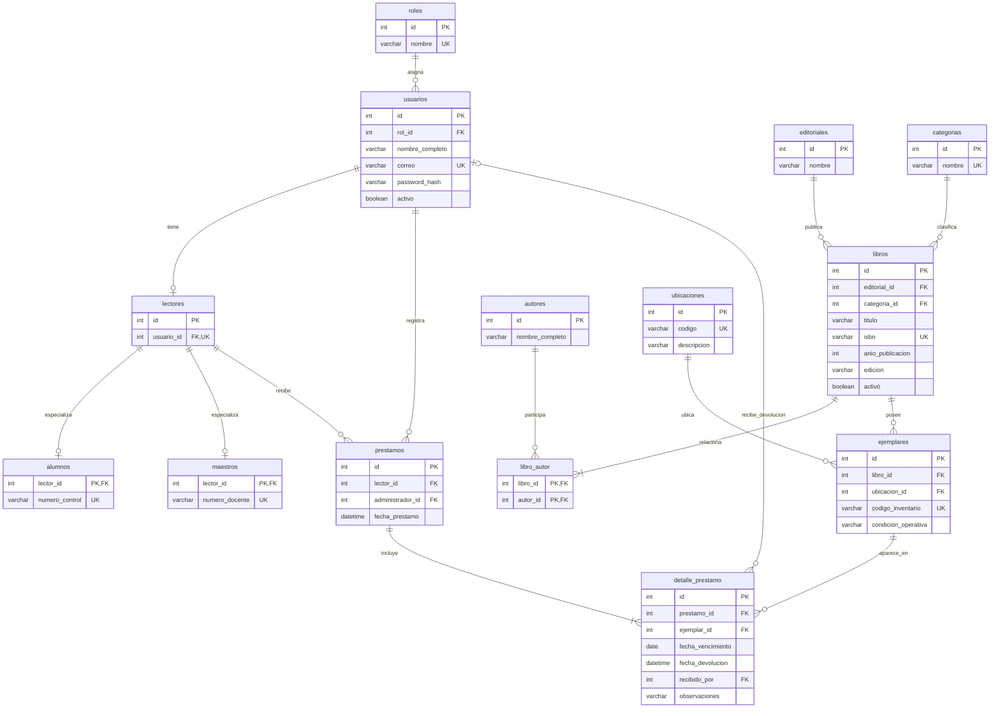
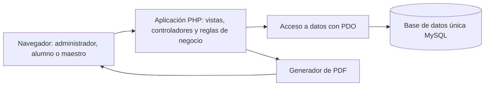

# BiblioApp — Sistema de gestión de biblioteca escolar

**Integrantes:**

- [#24410172 - Miguel Angel Ramirez Francisco]
- [No. de control 2 - Nombre completo del alumno 2]
- [No. de control 3 - Nombre completo del alumno 3]

---

## 1. Idea general

BiblioControl es una aplicación web para administrar el catálogo, los ejemplares físicos y los préstamos de una biblioteca escolar. Está dirigida al personal encargado de la biblioteca y a los alumnos y maestros de la institución.

La problemática que se busca atender es la dificultad de mantener un registro centralizado y actualizado de los libros disponibles, los ejemplares prestados, sus responsables y las fechas de devolución cuando estos procesos se realizan mediante registros manuales o archivos separados. Esta situación puede provocar consultas lentas, registros duplicados y dificultades para identificar préstamos vencidos.

El objetivo del sistema es centralizar esta información en una base de datos MySQL, facilitar el registro de préstamos y devoluciones, y proporcionar reportes que apoyen el seguimiento de la biblioteca.

Los alumnos se identificarán mediante su **número de control** y los maestros mediante su **número de docente**. Ambos serán lectores de la biblioteca y podrán consultar únicamente sus propios préstamos e historial. El personal administrador gestionará el catálogo, las cuentas, las operaciones y los reportes.

### Alcance de la primera versión

- Administrar una biblioteca de una sola institución escolar.
- Registrar cuentas de administradores y lectores, diferenciando alumnos y maestros.
- Administrar libros, autores, editoriales, categorías, ubicaciones y ejemplares físicos.
- Consultar el catálogo y la disponibilidad actual de los ejemplares.
- Registrar préstamos presenciales, con uno o varios ejemplares por operación.
- Registrar devoluciones individuales, incluso cuando un préstamo incluya varios ejemplares.
- Consultar préstamos activos, vencidos e historial personal.
- Generar cuatro tipos de reporte parametrizable en PDF.

Se distinguirá entre el **libro**, que representa una edición bibliográfica, y el **ejemplar**, que representa cada copia física disponible en la biblioteca. Por ejemplo, una edición puede tener cinco ejemplares con códigos distintos.

### Delimitaciones

La primera versión no incluirá reservas, renovaciones, multas, cobros, compras a proveedores, préstamos interbibliotecarios, libros digitales, notificaciones automáticas ni una aplicación móvil nativa. Los préstamos serán registrados por el administrador durante la entrega presencial. No habrá autorregistro de cuentas.

Las fechas de vencimiento se establecerán al registrar cada préstamo. No se implementarán inicialmente políticas automáticas diferentes de duración o cantidad de libros para alumnos y maestros.

Los requerimientos podrán afinarse durante el semestre, conservando el dominio aprobado: **gestión de una biblioteca escolar y sus préstamos a alumnos y maestros**.

## 2. Descripción de tablas

Se propone una base de datos relacional de **14 tablas**, diseñada con el objetivo de cumplir la tercera forma normal. Cada tabla tendrá una clave primaria y las relaciones se establecerán mediante claves foráneas. Los campos que se presentan son preliminares y podrán precisarse durante el diseño detallado.

| Tabla | Descripción y datos principales |
| --- | --- |
| `roles` | Define los permisos de acceso: Administrador y Lector. Contiene identificador y nombre único del rol. |
| `usuarios` | Almacena nombre completo, correo institucional único, hash de contraseña, estado activo/inactivo y referencia al rol. |
| `lectores` | Identifica a los usuarios que pueden recibir préstamos. Cada lector se asocia con una única cuenta mediante `usuario_id`, que será único. |
| `alumnos` | Extiende el perfil del lector con su número de control único. `lector_id` será simultáneamente clave primaria y foránea. |
| `maestros` | Extiende el perfil del lector con su número de docente único. `lector_id` será simultáneamente clave primaria y foránea. |
| `editoriales` | Registra las editoriales relacionadas con los libros del catálogo. |
| `categorias` | Registra la clasificación temática principal de los libros. Cada libro tendrá una categoría principal en esta versión. |
| `autores` | Almacena los nombres de los autores que participan en las obras del catálogo. |
| `libros` | Registra título, ISBN cuando exista, año de publicación, edición, editorial, categoría y estado activo/inactivo. Cada registro representa una edición bibliográfica. |
| `libro_autor` | Resuelve la relación de muchos a muchos entre libros y autores. Su clave primaria compuesta evita repetir la misma asociación. |
| `ubicaciones` | Registra los códigos y descripciones de estantes o secciones de la biblioteca. |
| `ejemplares` | Registra cada copia física con código de inventario único, libro, ubicación y condición operativa: habilitado, mantenimiento o baja. |
| `prestamos` | Almacena el lector, el administrador responsable del registro y la fecha y hora de la operación. |
| `detalle_prestamo` | Relaciona cada préstamo con sus ejemplares e incluye fecha de vencimiento, fecha y hora de devolución, administrador que recibe la devolución y observaciones. |

### Relaciones y normalización

- Un rol puede corresponder a muchos usuarios; cada usuario tendrá un solo rol.
- Cada usuario con rol Lector tendrá un perfil en `lectores` y exactamente un subtipo: alumno o maestro. Los administradores no tendrán perfil de lector en esta versión.
- Los números de control y docente se almacenarán como texto para conservar letras y ceros iniciales. Cada identificador será único dentro de su tipo de lector.
- Un libro puede tener varios autores y un autor puede participar en varios libros; esta relación se resuelve con `libro_autor`.
- Un libro puede tener varios ejemplares físicos y cada ejemplar pertenecerá a una sola ubicación actual.
- Un lector puede tener varios préstamos. Un préstamo tendrá uno o varios detalles, cada uno asociado a un ejemplar distinto.
- Un ejemplar puede aparecer en distintos préstamos históricos, pero solo podrá tener un préstamo pendiente de devolución a la vez.
- Los datos de usuarios, editoriales, autores y categorías se almacenarán en sus tablas respectivas; no se repetirán sus nombres en los registros de préstamo.
- La disponibilidad se calculará a partir de la condición operativa del ejemplar y de la existencia de un detalle sin devolución. No se guardará un indicador independiente de «prestado» que pueda contradecir el historial.
- Los días de atraso, totales y estados generales de los préstamos se calcularán al consultarlos, evitando almacenar valores derivados innecesarios.

Las claves únicas y foráneas protegerán la identidad y las relaciones. Las reglas que abarcan varias tablas, como la exclusividad alumno/maestro y el rol del usuario que registra una operación, se validarán en el servidor dentro de las transacciones correspondientes. La normalización se documentará con las dependencias funcionales durante el diseño detallado.

### Diagrama de base de datos

El siguiente diagrama utiliza Mermaid y muestra las claves y relaciones principales. `PK` significa clave primaria, `FK` clave foránea y `UK` restricción de unicidad. Las fechas de devolución y el administrador que recibe se mantendrán nulos mientras el ejemplar no haya sido devuelto.

**Reglas adicionales del diagrama:** las relaciones opcionales con `alumnos` y `maestros` representan una especialización exclusiva y obligatoria: cada lector debe pertenecer a una de ellas. Se añadirá una restricción única sobre `(prestamo_id, ejemplar_id)`. La prevención de préstamos activos simultáneos se realizará con transacciones y bloqueo del ejemplar durante el registro.

## 3. Tipos de usuario (roles)

El sistema distinguirá dos roles de autorización: **Administrador** y **Lector**. Dentro del rol Lector existirán dos perfiles escolares: **Alumno** y **Maestro**. El perfil escolar determina el identificador obligatorio; el rol determina los permisos.

| Rol o perfil | Acciones permitidas | Pantallas principales |
| --- | --- | --- |
| Administrador | Administrar cuentas y perfiles escolares; gestionar catálogo y ejemplares; registrar préstamos y devoluciones; consultar operaciones de todos los lectores y generar los cuatro reportes PDF. | Panel administrativo, usuarios y lectores, catálogo, ejemplares, préstamos, devoluciones y reportes. |
| Lector — Alumno | Consultar el catálogo y la disponibilidad, visualizar su número de control y consultar únicamente sus préstamos activos e historial. | Inicio del lector, catálogo, detalle del libro, mis préstamos, mi historial y mi perfil. |
| Lector — Maestro | Consultar el catálogo y la disponibilidad, visualizar su número de docente y consultar únicamente sus préstamos activos e historial. | Inicio del lector, catálogo, detalle del libro, mis préstamos, mi historial y mi perfil. |

Los lectores no podrán registrar sus propios préstamos, modificar el catálogo, consultar datos de otros lectores ni generar reportes administrativos. Los permisos se validarán en el servidor en cada operación, además de mostrar los menús correspondientes al rol.

## 4. Arquitectura

Se propone una **aplicación web monolítica con arquitectura de tres capas**. Todos los módulos utilizarán la misma base de datos MySQL, a través del servidor de la aplicación.

| Capa | Responsabilidad | Tecnología propuesta |
| --- | --- | --- |
| Presentación | Mostrar formularios, tablas, búsquedas y pantallas diferenciadas por rol. | HTML, CSS, Bootstrap y JavaScript. |
| Lógica de aplicación | Autenticar usuarios, validar permisos y reglas, procesar préstamos y devoluciones, y generar PDF. | PHP, organizado mediante el patrón Modelo–Vista–Controlador; Dompdf para reportes. |
| Persistencia | Almacenar las 14 tablas y ejecutar consultas y transacciones. | MySQL con InnoDB; conexión desde PHP mediante PDO y consultas parametrizadas. |

**Entorno de desarrollo propuesto:** Visual Studio Code, PHP, Composer para administrar dependencias, MySQL Server, MySQL Workbench y Git para control de versiones. Durante el desarrollo y la demostración se podrá ejecutar la aplicación localmente con el servidor de desarrollo de PHP y una instancia de MySQL.

El navegador no se conectará directamente a MySQL. Las consultas, validaciones y operaciones de todos los módulos pasarán por el backend. Las contraseñas se almacenarán mediante hash y el acceso se mantendrá con sesiones del servidor.

### Módulos

1. **Seguridad:** inicio y cierre de sesión, validación de cuentas activas y permisos.
2. **Usuarios y lectores:** administración de cuentas, perfiles de alumnos y maestros e identificadores escolares.
3. **Catálogo:** administración y consulta de libros, autores, editoriales y categorías.
4. **Ejemplares:** administración de copias físicas, ubicaciones y condición operativa.
5. **Préstamos:** registro, consulta, validación de disponibilidad y seguimiento de vencimientos.
6. **Devoluciones:** recepción de ejemplares y actualización del historial.
7. **Reportes:** filtros, consultas y descarga de documentos PDF.

## 5. Reportes

Los cuatro reportes serán generados por el administrador en formato PDF. Cada documento incluirá nombre del sistema, título del reporte, fecha y hora de generación, parámetros aplicados, resultados, totales pertinentes y numeración de páginas. Cuando no existan coincidencias, el PDF indicará que no se encontraron registros para los filtros seleccionados.

| ID | Reporte | Parámetros | Contenido |
| --- | --- | --- | --- |
| REP-01 | Préstamos realizados | Fecha inicial y final obligatorias, aplicadas a la fecha de préstamo; tipo de lector: todos, alumnos o maestros; lector específico opcional. | Folio, fecha de préstamo, lector, tipo e identificador escolar, administrador que registra, libros y códigos de ejemplar. Totales de préstamos y de ejemplares prestados, diferenciados. |
| REP-02 | Préstamos vencidos pendientes | Tipo de lector: todos, alumnos o maestros; categoría opcional; mínimo de días de atraso, entero igual o mayor que 1, con valor inicial de 1. | Ejemplares pendientes cuya fecha de vencimiento sea anterior a la fecha actual: lector, identificador escolar, libro, código de ejemplar, vencimiento y días de atraso. Total de ejemplares vencidos. |
| REP-03 | Libros más solicitados | Fecha inicial y final obligatorias, aplicadas a la fecha de préstamo; categoría opcional; tipo de lector: todos, alumnos o maestros; cantidad máxima de resultados: 5, 10 o 20. | Ranking de libros por número de detalles de préstamo asociados a sus ejemplares durante el periodo. Incluirá título, ISBN cuando exista y cantidad de préstamos de ejemplares. Los empates se ordenarán por título y después por identificador del libro. |
| REP-04 | Inventario de ejemplares | Categoría y ubicación opcionales; disponibilidad actual: todos, disponibles, prestados o fuera de servicio. | Código de ejemplar, título, categoría, ubicación, condición operativa y disponibilidad calculada. Totales por disponibilidad para los filtros elegidos. |

**Criterios de cálculo:**

- Los rangos de fechas incluirán ambos días y se rechazarán si la fecha inicial es posterior a la final.
- Los días de atraso se calcularán en días calendario respecto de la fecha actual configurada en el servidor. Un ejemplar que vence hoy no se considerará vencido.
- En REP-03 se contará cada ejemplar incluido en un préstamo como una ocurrencia; las devoluciones no eliminarán la operación del conteo histórico.
- Para REP-04, un ejemplar estará **prestado** si tiene un detalle sin devolución; estará **disponible** si no tiene préstamo pendiente, está habilitado y su libro está activo; en los demás casos estará **fuera de servicio**.
- REP-02 y REP-04 reflejarán la situación al generar el reporte; no reconstruirán inventarios ni atrasos de fechas pasadas.

## 6. Requerimientos funcionales

**Prioridades:** «Imprescindible» identifica funciones necesarias para el alcance comprometido y la rúbrica; «Deseable» identifica mejoras que podrán implementarse si el tiempo disponible lo permite. En la tabla, «Lector» incluye a alumnos y maestros.

| ID | Módulo | Nombre | Rol principal | Descripción del requerimiento | Prioridad |
| --- | --- | --- | --- | --- | --- |
| **RF-01** | Seguridad | Autenticar usuario | Administrador, Lector | El sistema permitirá iniciar sesión mediante correo institucional y contraseña, validará que la cuenta esté activa y mostrará el panel correspondiente al rol. Rechazará credenciales incorrectas. | Imprescindible |
| **RF-02** | Seguridad | Cerrar sesión | Administrador, Lector | El sistema permitirá cerrar la sesión e impedirá acceder nuevamente a las funciones protegidas sin autenticación. | Imprescindible |
| **RF-03** | Seguridad | Autorizar operaciones | Administrador, Lector | El sistema comprobará en el servidor los permisos de cada solicitud e impedirá que los lectores ejecuten funciones administrativas o accedan a préstamos y perfiles ajenos. | Imprescindible |
| **RF-04** | Usuarios y lectores | Registrar administrador | Administrador | El sistema permitirá registrar cuentas administrativas solicitando nombre completo, correo institucional único y contraseña. La primera cuenta administrativa se creará durante la instalación. | Imprescindible |
| **RF-05** | Usuarios y lectores | Registrar alumno | Administrador | El sistema permitirá registrar nombre completo, correo institucional único, contraseña y número de control obligatorio y único, creando de manera conjunta la cuenta, el lector y el perfil de alumno. | Imprescindible |
| **RF-06** | Usuarios y lectores | Registrar maestro | Administrador | El sistema permitirá registrar nombre completo, correo institucional único, contraseña y número de docente obligatorio y único, creando de manera conjunta la cuenta, el lector y el perfil de maestro. | Imprescindible |
| **RF-07** | Usuarios y lectores | Validar perfil escolar | Administrador | El sistema garantizará que cada lector tenga exactamente un perfil, alumno o maestro, y conservará sus identificadores como texto. En esta versión no permitirá cambiar el tipo de perfil ni convertir lectores en administradores. | Imprescindible |
| **RF-08** | Usuarios y lectores | Buscar y actualizar usuarios | Administrador | El sistema permitirá localizar usuarios por nombre, correo o identificador escolar, filtrar lectores por tipo y actualizar sus datos conservando las restricciones de unicidad. | Imprescindible |
| **RF-09** | Usuarios y lectores | Activar o desactivar cuentas | Administrador | El sistema permitirá activar y desactivar cuentas sin borrar su historial. Una cuenta inactiva no podrá acceder ni recibir nuevos préstamos, pero el administrador podrá registrar la devolución de sus ejemplares pendientes. Se impedirá desactivar al último administrador activo. | Imprescindible |
| **RF-10** | Usuarios y lectores | Consultar perfil propio | Lector | El sistema mostrará al lector su nombre, correo, tipo de perfil y número de control o de docente, según corresponda, sin permitirle modificar su rol ni identificador escolar. | Imprescindible |
| **RF-11** | Catálogo | Administrar catálogos bibliográficos | Administrador | El sistema permitirá registrar, consultar y editar autores, editoriales y categorías. Solo permitirá eliminar registros que no estén relacionados con libros. | Imprescindible |
| **RF-12** | Catálogo | Registrar y editar libros | Administrador | El sistema permitirá registrar y editar título, editorial, categoría principal y al menos un autor; podrá incluir año, edición e ISBN. Validará la unicidad del ISBN cuando se capture y no almacenará cadenas vacías como ISBN. | Imprescindible |
| **RF-13** | Catálogo | Dar de baja libros | Administrador | El sistema permitirá desactivar libros sin borrar sus ejemplares ni historial. Impedirá la baja mientras cualquiera de sus ejemplares tenga un préstamo pendiente y evitará nuevos préstamos de libros inactivos. | Imprescindible |
| **RF-14** | Catálogo | Buscar libros y consultar disponibilidad | Administrador, Lector | El sistema permitirá buscar libros por título, autor o ISBN, filtrar por categoría y consultar su información y cantidad de ejemplares disponibles. Los lectores visualizarán los libros activos. | Imprescindible |
| **RF-15** | Ejemplares | Administrar ubicaciones | Administrador | El sistema permitirá registrar, consultar y editar ubicaciones con código único. Impedirá eliminar una ubicación mientras tenga ejemplares asociados. | Imprescindible |
| **RF-16** | Ejemplares | Registrar y actualizar ejemplares | Administrador | El sistema permitirá registrar cada copia física con código de inventario único, libro, ubicación y condición operativa, así como actualizar su ubicación y condición. No permitirá reasignar a otro libro un ejemplar con historial de préstamos. | Imprescindible |
| **RF-17** | Ejemplares | Cambiar condición operativa | Administrador | El sistema permitirá marcar ejemplares como habilitados, en mantenimiento o de baja. Impedirá el paso a mantenimiento o baja si existe una devolución pendiente y conservará el historial de los ejemplares dados de baja. | Imprescindible |
| **RF-18** | Préstamos | Identificar lector | Administrador | El sistema permitirá seleccionar el tipo de lector y localizarlo por número de control, número de docente o nombre, mostrando sus datos y préstamos pendientes antes de registrar una operación. | Imprescindible |
| **RF-19** | Préstamos | Registrar préstamo | Administrador | El sistema permitirá prestar uno o varios ejemplares distintos a un lector activo, asignará folio, administrador y fecha y hora del servidor, y exigirá una fecha de vencimiento por ejemplar igual o posterior al día del préstamo. | Imprescindible |
| **RF-20** | Préstamos | Validar disponibilidad y guardar operación | Administrador | El sistema rechazará ejemplares con préstamo pendiente, en mantenimiento, de baja o asociados a libros inactivos. Validará y bloqueará los ejemplares durante una transacción; si alguno no cumple las reglas, no guardará ninguna parte del préstamo. | Imprescindible |
| **RF-21** | Préstamos | Consultar operaciones | Administrador | El sistema permitirá consultar préstamos y sus detalles, filtrando por periodo de registro, lector, tipo de lector y estado calculado: pendiente, parcialmente devuelto o concluido. Permitirá identificar detalles vencidos aún no devueltos. | Imprescindible |
| **RF-22** | Préstamos | Consultar préstamos e historial propios | Lector | El sistema mostrará exclusivamente los préstamos del lector autenticado, incluyendo libro, ejemplar, fecha de préstamo, vencimiento, devolución y aviso cuando exista atraso pendiente. | Imprescindible |
| **RF-23** | Devoluciones | Registrar devolución por ejemplar | Administrador | El sistema permitirá localizar un detalle pendiente por folio o código de ejemplar y registrar su devolución con fecha y hora del servidor, administrador receptor y observaciones opcionales. La devolución de un ejemplar no cerrará los demás detalles pendientes. | Imprescindible |
| **RF-24** | Devoluciones | Validar devolución y condición | Administrador | El sistema impedirá devolver dos veces un mismo detalle y permitirá indicar si el ejemplar recibido queda habilitado, en mantenimiento o de baja. Guardará la devolución y la condición resultante en una sola transacción. | Imprescindible |
| **RF-25** | Reportes | Generar reporte de préstamos realizados | Administrador | El sistema generará REP-01 en PDF con rango de fechas, tipo de lector y lector opcional, incluyendo los datos y totales definidos en la sección 5. | Imprescindible |
| **RF-26** | Reportes | Generar reporte de préstamos vencidos | Administrador | El sistema generará REP-02 en PDF con tipo de lector, categoría opcional y mínimo de días de atraso, incluyendo únicamente ejemplares vencidos pendientes de devolución. | Imprescindible |
| **RF-27** | Reportes | Generar ranking de libros | Administrador | El sistema generará REP-03 en PDF con rango de fechas, categoría opcional, tipo de lector y límite de resultados, ordenado por frecuencia de préstamo. | Imprescindible |
| **RF-28** | Reportes | Generar inventario de ejemplares | Administrador | El sistema generará REP-04 en PDF filtrando por categoría, ubicación y disponibilidad actual, incluyendo ejemplares fuera de servicio cuando el filtro lo permita. | Imprescindible |
| **RF-29** | Reportes | Validar parámetros y descargar PDF | Administrador | El sistema validará los parámetros de cada reporte, rechazará rangos de fechas inválidos y permitirá descargar el PDF con los filtros aplicados. Si no hay resultados, generará el documento con una indicación explícita de ausencia de registros. | Imprescindible |
| **RF-30** | Préstamos | Mostrar indicadores generales | Administrador | El sistema mostrará en el inicio administrativo cantidades actuales de ejemplares disponibles, ejemplares prestados y ejemplares vencidos pendientes. | Deseable |

### Comprobación de los requisitos obligatorios

| Requisito de la propuesta | Forma de cumplimiento |
| --- | --- |
| Diez tablas o más, interrelacionadas y normalizadas | Modelo propuesto de 14 tablas, con entidades bibliográficas, cuentas, subtipos de lector y operaciones; relación de muchos a muchos resuelta mediante tabla intermedia. |
| Dos roles o más, incluyendo Administrador | Roles Administrador y Lector, con pantallas y permisos distintos; lectores diferenciados en alumnos y maestros. |
| Una misma base de datos MySQL | Aplicación web cuyos módulos acceden mediante el backend a una única base de datos MySQL. |
| Cuatro reportes PDF parametrizables | REP-01 a REP-04, cada uno con filtros explícitos y descarga en PDF. |
